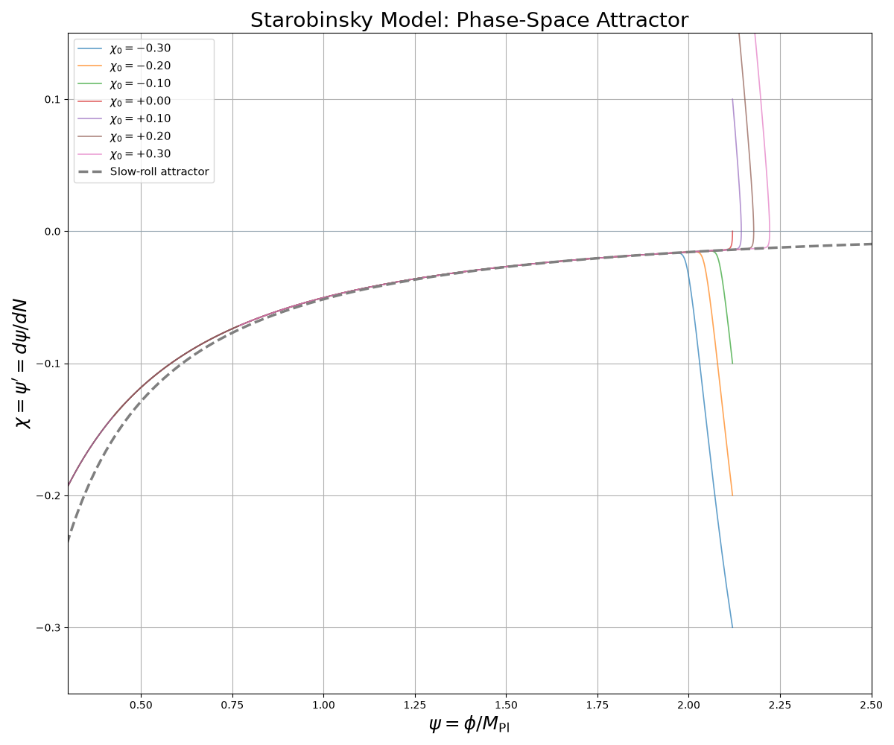
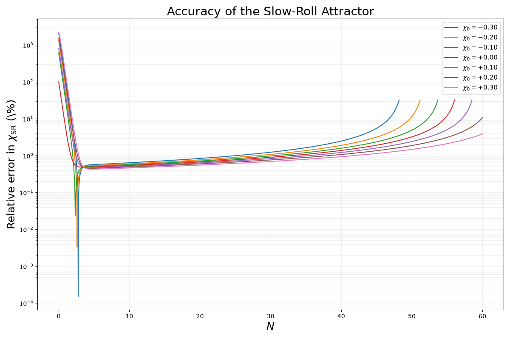
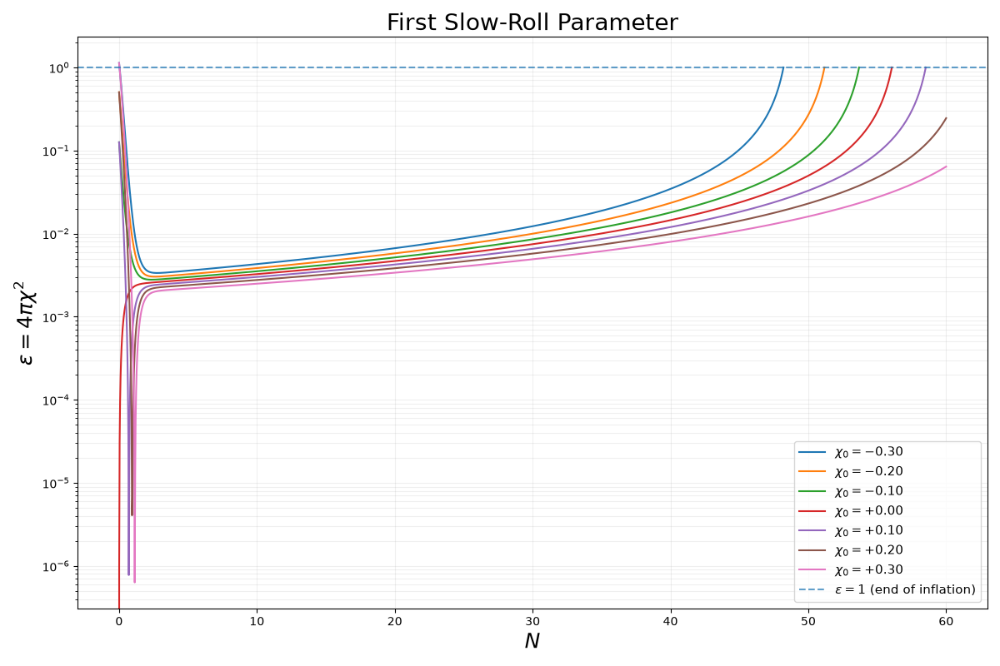

# Dynamical Systems Analysis of Inflation

Numerical study of dynamical systems with an application to the inflationary dynamics of the Starobinsky model.

This project introduces phase-space analysis using the damped harmonic oscillator as a simple physical example, and then applies the same framework to investigate the inflationary attractor of the Starobinsky model.

## 1. Damped Harmonic Oscillator

As a simple physical example of a dynamical system, we consider the damped harmonic oscillator

$$
\ddot{x}+\delta\dot{x}+\omega^2x=0,
$$

where $$\omega$$ is the natural frequency and $$\delta$$ is the damping coefficient.

Introducing

$$
y=\dot{x},
$$

the second-order equation becomes the first-order dynamical system

$$
\begin{cases}
\dot{x}=y,\\
\dot{y}=-\omega^2x-\delta y.
\end{cases}
$$

The system has a fixed point at

$$
(x,y)=(0,0).
$$

The behavior of trajectories in phase space depends on the damping coefficient.

### Damping regimes

The eigenvalues of the system are determined by

$$
\lambda^2+\delta\lambda+\omega^2=0.
$$

Three qualitatively different regimes are considered.

#### Overdamping

For

$$
\delta>2\omega,
$$

the eigenvalues are distinct, real, and negative. The trajectories approach the fixed point without oscillating.

The fixed point is a **stable node**.

For the numerical example,

$$
\omega=1,\qquad \delta=3.
$$

#### Critical damping

For

$$
\delta=2\omega,
$$

the eigenvalues are repeated and negative. The system approaches the fixed point without oscillating.

The fixed point is a **degenerate stable node**.

For the numerical example,

$$
\omega=1,\qquad \delta=2.
$$

#### Underdamping

For

$$
\delta<2\omega,
$$

the eigenvalues are complex with negative real parts. The trajectories spiral toward the fixed point while their amplitude decreases.

The fixed point is a **stable spiral (spiral sink)**.

For the numerical example,

$$
\omega=1,\qquad \delta=1.
$$

### Numerical phase-space analysis

The three damping regimes are solved numerically using `scipy.integrate.solve_ivp`.

For each regime, several different initial conditions are used:

$$
(x_0, y_0)=
(1,0),\,
(0,1),\,
(-1,0.5),\,
(1.5,-1),\,
(-1.5,-0.5).
$$

The trajectories are plotted in the phase space $$(x,y)$$.

Despite starting from different initial conditions, all trajectories approach the same fixed point. The geometry of the approach depends on the eigenvalue structure:

$$
\boxed{
\begin{array}{c}
\text{Overdamped} \rightarrow \text{stable node}\\
\text{Critical} \rightarrow \text{degenerate stable node}\\
\text{Underdamped} \rightarrow \text{stable spiral}
\end{array}
}
$$

This provides a simple example of how the eigenvalues of a dynamical system determine the local phase-space behavior and the type of attractor.

## 2. Starobinsky Inflation as a Dynamical System

The same phase-space approach can be applied to the dynamics of inflation.

In this project, the background dynamics of the Starobinsky model are formulated as a nonlinear dynamical system and solved numerically.

The variables are normalized with respect to the reduced Planck mass:

$$
h=\frac{H}{M_{\rm Pl}},
$$

$$
\psi=\frac{\phi}{M_{\rm Pl}},
$$

and

$$
\chi=\psi'=\frac{d\psi}{dN},
$$

where $N$ is the number of e-folds and a prime denotes differentiation with respect to $N$.

The dynamical system is

$$
h'=-4\pi h\chi^2,
$$

$$
\psi'=\chi,
$$

and

$$
\chi'=
4\pi\chi^3
-3\chi -
\frac{
2\alpha^2\sqrt{2/3}\,
e^{-\sqrt{2/3}\psi}
\left(1-e^{-\sqrt{2/3}\psi}\right)
}{
h^2
}.
$$

The initial Hubble parameter is determined from the Friedmann constraint.

For the numerical analysis, the parameters are chosen as

$$
\alpha=0.01,
\qquad
\psi_0=2.12.
$$

Different initial values of $\chi_0$ are considered in order to investigate the sensitivity of the dynamics to the initial field velocity.

The system is integrated using the adaptive fourth/fifth-order Runge–Kutta method (`RK45`) implemented in `scipy.integrate.solve_ivp`.

The resulting trajectories are studied in the phase space

$$
(\psi,\chi).
$$

## 3. Numerical Method

The coupled differential equations are solved numerically using the adaptive fourth-order/fifth-order Runge–Kutta method (`RK45`) implemented in `scipy.integrate.solve_ivp`.

The numerical integration is performed with

```python
method="RK45"

The numerical integration is performed with the following numerical parameters:

```python
rtol = 1e-8
atol = 1e-10
max_step = 0.05
```

These parameters control the relative tolerance, absolute tolerance, and maximum integration step size, respectively.

## 4. Phase-Space Attractor

The inflationary dynamics are studied in the phase space $(\psi,\chi)$, where

$$
\chi=\frac{d\psi}{dN}.
$$

Several trajectories are generated using different initial values of $\chi_0$, while keeping $\psi_0$ fixed.

The numerical trajectories converge toward a common inflationary trajectory, demonstrating the attractor behavior of the system.

The analytical slow-roll attractor is

$$
\chi_{\rm SR}(\psi)
=
-\frac{1}{4\pi}
\sqrt{\frac{2}{3}}
\frac{
e^{-\sqrt{2/3}\psi}
}{
1-e^{-\sqrt{2/3}\psi}
}.
$$

The numerical trajectories are compared with this analytical curve in the phase-space plot below.



## 5. Slow-Roll Approximation

The numerical solution can be compared with the analytical slow-roll attractor to quantify the accuracy of the slow-roll approximation.

The absolute deviation is defined as

$$
\Delta\chi
=
\chi_{\rm numerical}
-
\chi_{\rm SR}.
$$

The relative deviation is defined by

$$
\delta_{\rm SR}
=
\left|
\frac{
\chi_{\rm numerical}-\chi_{\rm SR}
}{
\chi_{\rm SR}
}
\right|.
$$

The trajectories initially exhibit a transient phase as they approach the slow-roll attractor. After this transient, the relative deviation remains small over a substantial part of inflation.

As inflation approaches its end, the deviation from the slow-roll solution increases, indicating the gradual breakdown of the slow-roll approximation.

### Absolute deviation


### Relative deviation



## 6. End of Inflation

The end of inflation is determined using the first slow-roll parameter,

$$
\epsilon
=
-\frac{H'}{H}.
$$

From the dynamical equation

$$
h'=-4\pi h\chi^2,
$$

we obtain

$$
\boxed{\epsilon=4\pi\chi^2}.
$$

Inflation occurs while

$$
\epsilon<1,
$$

and ends when

$$
\boxed{\epsilon=1}.
$$

The numerical integration uses this condition as an event to determine the number of e-folds at the end of inflation.

For example, for several initial values of $\chi_0$, the numerical results are:

| $\chi_0$ | $N_{\rm end}$ |
|---:|---:|
| $-0.20$ | $51.17$ |
| $-0.10$ | $53.68$ |
| $0.00$ | $56.06$ |
| $+0.10$ | $58.52$ |

The trajectories therefore give different total durations of inflation for different initial velocities, while converging toward the same inflationary attractor in phase space.



## 7. Summary of Results

The numerical analysis demonstrates the attractor behavior of the Starobinsky inflationary system.

The main results are:

- Trajectories with different initial field velocities converge toward a common inflationary attractor in the $(\psi,\chi)$ phase space.
- The initial transient is rapidly damped, showing that the system loses sensitivity to the initial value of $\chi$.
- The numerical trajectories remain close to the analytical slow-roll attractor over a substantial part of inflation.
- The relative deviation from the slow-roll approximation remains at the sub-percent level during the main slow-roll regime and increases as inflation approaches its end.
- The first slow-roll parameter $\epsilon=4\pi\chi^2$ remains below unity during inflation and reaches $\epsilon=1$ at the end of inflation.
- For the initial conditions considered, the total number of e-folds is of order $50$–$60$ for several trajectories.

Together, these results illustrate how phase-space methods and numerical integration can be used to study the stability and evolution of inflationary solutions.
